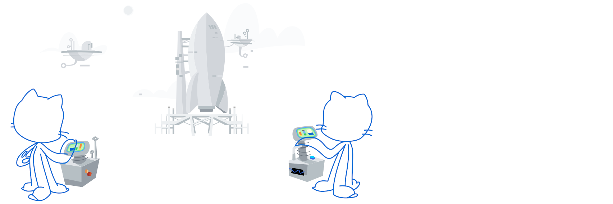

### Hi, [I'm Salva](https://salvacorts.github.io) 👋

- 🧐 Interested in Data and Distributed Systems
- 💼 Software Engineer at [RTI](https://www.rti.com/en/) (Remote)
- 🎓 BS Computer Science at [UBC](https://www.ubc.ca) and [UGR](https://www.ugr.es/en/)
- 🌱 Pursuing a Ms in Data Science
- ⚡️ Fun-Fact: In my free time I fly planes ✈️

 

    
    

  
  
    
    

